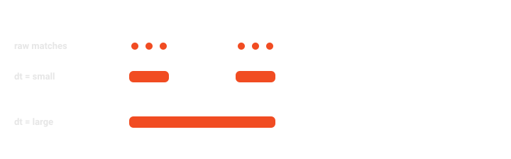
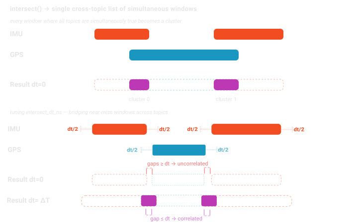
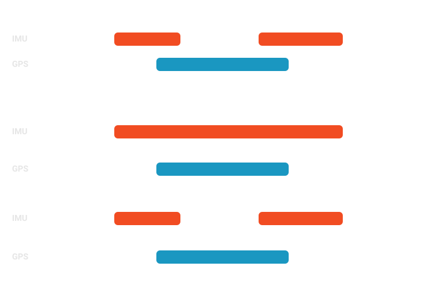

The **Query Workflow** in Mosaico provides a high-performance, **fluent** interface for discovering and filtering data within the Mosaico Data Platform. It is designed to move beyond simple keyword searches, allowing you to perform deep, semantic queries across metadata, system catalogs, and the physical content of sensor streams.

!!! info "API-Keys"
    When the connection is established via the authorization middleware (i.e. using an [API-Key](./client.md#2-authentication-api-key)), the query workflow requires the `read` permission.

!!! example "Try-It Out"
    You can experiment yourself the Query module via the **[Querying Catalogs](https://docs.mosaico.dev/examples/querying_catalogs) Example**.

A typical query workflow involves chaining methods within specialized builders to create a unified request that the server executes atomically. In the example below, the code orchestrates a multi-domain search to isolate high-interest data segments. Specifically, it queries for:

* **Sequence Discovery**: Finds any recording session whose name contains the string `"test_drive"` **AND** where the custom user metadata indicates an `"environment.visibility"` value strictly less than 50.
* **Topic Filtering**: Restricts the search specifically to the data channel named `"/front/camera/image"`.
* **Ontology Analysis**: Performs a deep inspection of IMU sensor payloads to identify specific time segments where the **X-axis acceleration exceeds a certain threshold** while simultaneously the **Y-axis acceleration exceeds a certain threshold**.

```python
from mosaicolabs import QueryOntologyCatalog, QuerySequence, QueryTopic, IMU, MosaicoClient

# Establish a connection to the Mosaico Data Platform
with MosaicoClient.connect("localhost", 6726) as client:
    # Perform a unified server-side query across multiple domains:
    qresponse = client.query(
        # Filter Sequence-level metadata
        QuerySequence()
        # Use convenience method for fuzzy name matching
        .with_name_match("test_drive")
        # Use convenience method for filtering user metadata
        .with_user_metadata("environment.visibility", lt=50),
        # Search on topics with specific names
        QueryTopic()
        .with_name("/front/camera/image"),
        # Perform deep time-series discovery within sensor payloads
        QueryOntologyCatalog()
        # Use the .Q proxy to filter the `acceleration` field
        .with_expression(IMU.Q.acceleration.x.gt(5.0))
        .with_expression(IMU.Q.acceleration.y.gt(4.0)),
    )

    # The server returns a QueryResponse grouped by Sequence
    # for structured data management
    if qresponse is not None:
        for item in qresponse:
            # 'item.sequence' contains the name for the matched sequence
            print(f"Sequence: {item.sequence.name}") 
            print(f"Topics: {[topic.name for topic in item.topics]}")
    
            # Clusterize all topics within the sequence to extract the time intervals
            clusters_dict = item.clusterize_all()

            # Since clusterize_all() used default clustering_dt_ns, each topic will have
            # just one cluster representing the first and last moment the query was satisfied
            for t_name, clusters in clusters_dict.items():
                print(f"{t_name}:\n", "\n".join(f"{cluster}" for cluster in clusters))

```

The provided example illustrates the core architecture of the Mosaico Query DSL. To effectively use this module, it is important to understand the two primary mechanisms that drive data discovery:

* **Query Builders (Fluent Logic Collectors)**: Specialized builders like [`QuerySequence`][mosaicolabs.models.query.builders.QuerySequence], [`QueryTopic`][mosaicolabs.models.query.builders.QueryTopic], and [`QueryOntologyCatalog`][mosaicolabs.models.query.builders.QueryOntologyCatalog] serve as containers for your search criteria. They provide a **Fluent Interface** where you can chain two types of methods:
    * **Convenience Methods**: High-level helpers for common fields, such as `with_user_metadata()`, `with_name_match()`, or `with_created_timestamp()`.
    * **Generic `with_expression()`**: A versatile method that accepts any expression obtained via the **`.Q` proxy**, allowing you to define complex filters for deep sensor payloads.
* **The `.Q` Proxy (Dynamic Model Inspection)**: Every [`Serializable`][mosaicolabs.models.core.Serializable] model in the Mosaico ontology features a static `.Q` attribute. This proxy dynamically inspects the model's underlying schema to build dot-notated field paths and intercepts attribute access (e.g., `IMU.Q.acceleration.x`). When a terminal method is called—such as `.gt()`, `.lt()`, or `.between()`—it generates a type-safe **Atomic Expression** used by the platform to filter physical sensor data or metadata fields.

By combining these mechanisms, the Query Module delivers a robust filtering experience:

* **Multi-Domain Orchestration**: Execute searches across Sequence metadata, Topic configurations, and raw Ontology sensor data in a single, atomic request.
* **Structured Response Management**: Results are returned in a [`QueryResponse`][mosaicolabs.models.query.response.QueryResponse] that is automatically grouped by `Sequence`, making it easier to manage multi-sensor datasets.

## Query Execution & The Response Model

Queries are executed via the [`query()`][mosaicolabs.comm.MosaicoClient.query] method exposed by the [`MosaicoClient`][mosaicolabs.comm.MosaicoClient] class. When multiple builders are provided, they are combined with a logical **AND**.

| Method | Return | Description |
| :--- | :--- | :--- |
| [`query(*queries, query)`][mosaicolabs.comm.MosaicoClient.query] | [`Optional[QueryResponse]`][mosaicolabs.models.query.response.QueryResponse] | Executes one or more queries against the platform catalogs. The provided queries are joined in AND condition. The method accepts a variable arguments of query builder objects or a pre-constructed [`Query`][mosaicolabs.models.query.builders.Query] object.|


The query execution returns a [`QueryResponse`][mosaicolabs.models.query.response.QueryResponse] object, which behaves like a standard Python list containing [`QueryResponseItem`][mosaicolabs.models.query.response.QueryResponseItem] objects.

| Class | Description |
| --- | --- |
| [`QueryResponseItem`][mosaicolabs.models.query.response.QueryResponseItem] | Groups all matches belonging to the same **Sequence**. Contains a `QueryResponseItemSequence` and a list of related `QueryResponseItemTopic`.|
| [`QueryResponseItemSequence`][mosaicolabs.models.query.response.QueryResponseItemSequence] | Represents a specific **Sequence** where matches were found. It includes the sequence name. |
| [`QueryResponseItemTopic`][mosaicolabs.models.query.response.QueryResponseItemTopic] | Represents a specific **Topic** where matches were found. It includes the normalized topic path, the `ontology_tag` of the returned topic and the topic `name`. |

```python
import sys
from mosaicolabs import MosaicoClient, QueryOntologyCatalog
from mosaicolabs.models.sensors import IMU

# Establish a connection to the Mosaico Data Platform
with MosaicoClient.connect("localhost", 6726) as client:
    
    # Define a Deep Data Filter using the .Q Query Proxy
    # We are searching for vertical impact events where acceleration.z > 15.0 m/s^2
    impact_qbuilder = QueryOntologyCatalog(
        IMU.Q.acceleration.z.gt(15.0),
    )

    # Execute the query via the client
    results = client.query(impact_qbuilder)
    # The same can be obtained by using the Query object
    # results = client.query(
    #     query = Query(
    #         impact_qbuilder
    #     )
    # )
    
    if results is not None:
        # Results are automatically grouped by Sequence for easier data management
        for item in results:
            print(f"Sequence: {item.sequence.name}")

            clustering_map = {IMU.ontology_tag(): int(1e9)}

            for topic in item.topics:
                # Topic names are normalized (sequence prefix is stripped) for direct use
                print(f"  - Match in: {topic.name}")
               
                clustering_dt_ns = clustering_map.get(topic.ontology_tag)

                print(
                    f"{topic.name}",
                    ", ".join(
                        f"{cluster}" for cluster in topic.clusterize(clustering_dt_ns)
                    ),
                )

```
* **Result Normalization**: `topic.name` returns the relative topic path (e.g., `/sensors/imu`), making it immediately compatible with other SDK methods like [`topic_handler()`][mosaicolabs.comm.MosaicoClient.topic_handler].
* **Temporal Windows**: The `clusterize()` called for each `topic` divides in time intervals (or clusters) the overall timerange where the query is satisfied. `clustering_dt_ns` specifies the minimal distance there needs to be between two clusters to be considered distinct. Tuning `clustering_dt_ns` for each `ontology_tag` can be used to filter too close clusters (merging them into a single one) or to handle different sensors' sampling time (`IMU`, `GPS`, `Pose`, ...). Refer to [Temporal Window for Topics and Sequences](#temporal-windows) for more insights about `clusterize()`, `clusterize_all()`, and `intersect()`.

### Restricted Queries (Chaining)
The `QueryResponse` class enables a powerful mechanism for **iterative search refinement** by allowing you to convert your current results back into a new query builder.
This approach is essential for resolving complex, multi-modal dependencies where a single monolithic query would be logically ambiguous, inefficient or technically impossible.

| Method | Return Type | Description |
| --- | --- | --- |
| [`to_query_sequence()`][mosaicolabs.models.query.response.QueryResponse.to_query_sequence] | [`QuerySequence`][mosaicolabs.models.query.builders.QuerySequence] | Returns a query builder pre-filtered to include only the **sequences** present in the response. |
| [`to_query_topic()`][mosaicolabs.models.query.response.QueryResponse.to_query_topic] | [`QueryTopic`][mosaicolabs.models.query.builders.QueryTopic] | Returns a query builder pre-filtered to include only the specific **topics** identified in the response. |

When you invoke these factory methods, the SDK generates a new query expression containing an explicit `$in` filter populated with the identifiers held in the current response. This effectively **"locks" the search domain**, allowing you to apply new criteria to a restricted subset of your data without re-scanning the entire platform catalog.

```python
from mosaicolabs import MosaicoClient, QueryTopic, QueryOntologyCatalog, GPS, String

with MosaicoClient.connect("localhost", 6726) as client:
    # Broad Search: Find all sequences where a GPS sensor reached a high-precision state (status=2)
    initial_response = client.query(
        QueryOntologyCatalog(GPS.Q.status.status.eq(2))
    )
    # 'initial_response' now acts as a filtered container of matching sequences.

    # Domain Locking: Restrict the search scope to the results of the initial query
    if not initial_response.is_empty():
        # .to_query_sequence() generates a QuerySequence pre-filled with the matching sequence names.
        refined_query_builder = initial_response.to_query_sequence()

        # Targeted Refinement: Search for error patterns ONLY within the restricted domain
        # This ensures the platform only scans for strings containing '[ERR]' within sequences
        # already validated for GPS precision. Note the surrounding "*" wildcards: "[ERR]" alone
        # would be parsed as a single-character set (matching just "E" or "R"), not a substring.
        final_response = client.query(
            refined_query_builder,                                         # The "locked" sequence domain
            QueryTopic().with_name("/localization/log_string"),    # Target a specific log topic
            QueryOntologyCatalog(String.Q.data.match("*[ERR]*"))   # Filter by data content substring
        )

```

When a specific set of topics has been identified through a data-driven query (e.g., finding every camera topic that recorded a specific event), you can use `to_query_topic()` to "lock" your next search to those specific data channels. This is particularly useful when you need to verify a condition on a very specific subset of sensors across many sequences, bypassing the need to re-identify those topics in the next step.

In the next example, we first find all topics of a specific channel from a specific sequence name pattern, and then search specifically within *those* topics for any instances where the data content matches a specific pattern.

```python
from mosaicolabs import MosaicoClient, QueryTopic

with MosaicoClient.connect("localhost", 6726) as client:
    # Broad Search: Find sequences with high-precision GPS
    initial_response = client.query(
            QueryTopic().with_name("/localization/log_string"), # Target a specific log topic
            QuerySequence().with_name_match("test_winter_2025_")  # Filter by sequence name pattern
        )

    # Chaining: Use results to "lock" the domain and find specific log-patterns in those sequences
    if not initial_response.is_empty():
        final_response = client.query(
            initial_response.to_query_topic(),              # The "locked" topic domain
            QueryOntologyCatalog(String.Q.data.match("*[ERR]*"))  # Filter by content substring
        )
```

#### When Chaining is Necessary

The previous example of the `GPS.status` query and the subsequent `/localization/log_string` topic search highlight exactly when *query chaining* becomes a technical necessity rather than just a recommendation. In the Mosaico Data Platform, a single `client.query()` call applies a logical **AND** across all provided builders to locate individual **data streams (topics)** that satisfy every condition simultaneously.
Because a single topic cannot physically represent two different sensor types at once, such as being both a `GPS` sensor and a `String` log, a monolithic query attempting to filter for both on the same stream will inherently return zero results. Chaining resolves this by allowing you to find the correct **Sequence** context in step one, then "locking" that domain to find a different **Topic** within that same context in step two.

```python
# AMBIGUOUS: This looks for ONE topic that is BOTH GPS and String
response = client.query(
    QueryOntologyCatalog(GPS.Q.status.status.eq(DGPS_FIX)),
    QueryOntologyCatalog(String.Q.data.match("*[ERR]*")),
    QueryTopic().with_name("/localization/log_string")
)

```

### Wildcards patterns Queries

Mosaico exposes a `match` operator that can perform lightweight, glob-style pattern matching instead of requiring an exact value. This `match` operator applies to:

* **Sequence and topic names**, via [`QuerySequence.with_name_match()`][mosaicolabs.models.query.builders.QuerySequence.with_name_match] for matching sequence names or [`QueryTopic.with_name_match()`][mosaicolabs.models.query.builders.QueryTopic.with_name_match] for matching topic names.
* **User metadata values**, via [`with_user_metadata(key, match=...)`][mosaicolabs.models.query.builders.QueryTopic.with_user_metadata] on both `QuerySequence` and `QueryTopic` to match metadata **values** .
* **Ontology field values**, via the `.match()` operator on any string-typed field reached through the `.Q` proxy (e.g. `String.Q.data.match(...)`) inside a [`QueryOntologyCatalog`][mosaicolabs.models.query.builders.QueryOntologyCatalog].

In all of these cases, the pattern is a lightweight glob syntax rather than full RegEx, and it supports the following wildcards:

| Wildcard | Description | Example | Matches |
| --- | --- | --- | --- |
| `*` | Zero or more characters, including spaces | `*imu` | `front_imu`, `camera_imu` |
| `?` | Exactly one character, including spaces | `?.2.0` | `1.2.0`, `3.2.0` (not `10.2.0`) |
| `[]` | A character set or range | `[gs]*` / `[a-z]*` | `gyrolytics`, `satnavics` |
| `#` | Any single digit (`0`-`9`); shorthand for `[0-9]` | `test-query-sequence-#` | `test-query-sequence-1` |

```python
from mosaicolabs import MosaicoClient, QueryOntologyCatalog, QuerySequence, QueryTopic, String

with MosaicoClient.connect("localhost", 6726) as client:
    # Sequences following the "test-query-sequence-<digit>" convention
    qresponse = client.query(QuerySequence().with_name_match("test-query-sequence-#"))

    # Metadata VALUE matching: firmware versions like "1.2.0" or "3.2.0", but not "2.1.0"
    qresponse = client.query(
        QueryTopic().with_user_metadata("firmware_version", match="?.2.0")
    )

    # Metadata VALUE matching: vendor names starting with 'g' or 's'
    qresponse = client.query(
        QueryTopic().with_user_metadata("vendor", match="[gs]*")
    )

    # Ontology VALUE matching: string payloads containing an "[ERR]"-style tag
    qresponse = client.query(
        QueryOntologyCatalog(String.Q.data.match("*[ERR]*"))
    )
```

!!! note
    These wildcards are only meaningful together with the `match` operator (`$match`). Other operators such as `eq` or `in_` always compare against the literal, exact string.

#### Using glob pattern for metadata keys

Beyond matching metadata **values**, [`with_user_metadata()`][mosaicolabs.models.query.builders.QueryTopic.with_user_metadata] also accepts a glob pattern for the `key` itself. This lets you target a metadata field without knowing its exact nesting depth or prefix. Two wildcards are supported in the key path:

- `*` matches exactly **one** key segment.
- `**` matches **one or more** key segments, at any depth.

| Key pattern | Matches (examples) |
| --- | --- |
| `*.status` | `step1.status`, `step2.status` |
| `*.*.status` | `action.pick.status`, `action.move.status`, `step1.substep.status` |
| `action.*.status` | `action.pick.status`, `action.move.status` |
| `action.**.status` | `action.pick.status`, `action.pick.fast.status`, `action.pick.slow.status` |
| `**.status` | `action.pick.status`, `action.pick.fast.status`, `step1.substep.status` |

```python
from mosaicolabs import MosaicoClient, QuerySequence, QueryTopic

with MosaicoClient.connect("localhost", 6726) as client:
    # Match any key ending in ".type", one level deep (e.g. interface.type)
    qresponse = client.query(
        QueryTopic().with_user_metadata("*.type", match="UART*")
    )

    # Match "baudrate" nested at ANY depth under "interface"
    qresponse = client.query(
        QueryTopic().with_user_metadata("interface.**.baudrate", geq=1000)
    )

    # Match "country" nested exactly one level deep (e.g. location.country)
    qresponse = client.query(
        QuerySequence().with_user_metadata("*.country", match="IT")
    )

    # Match "overall_quality_score" nested at ANY depth under "quality_metrics"
    qresponse = client.query(
        QuerySequence().with_user_metadata(
            "quality_metrics.**.overall_quality_score", geq=0.9
        )
    )
```

!!! note
    Key globs and value wildcards can be freely combined, as shown above (`*.type` as the key with `UART*` as the value pattern).

## Query Layers

Mosaico organizes data into three distinct architectural layers, each with its own specialized Query Builder:

### [`QuerySequence`][mosaicolabs.models.query.builders.QuerySequence] (Sequence Layer)
??? question "API Reference"
    [`mosaicolabs.models.query.builders.QuerySequence`][mosaicolabs.models.query.builders.QuerySequence].

Filters recordings based on high-level session metadata, such as the sequence name or the time it was created.

**Example** Querying for sequences by name and creation date

```python
from mosaicolabs import MosaicoClient, Topic, QuerySequence

with MosaicoClient.connect("localhost", 6726) as client:
    # Search for sequences by project name and creation date
    qresponse = client.query(
        QuerySequence()
        .with_name_match("test_drive")
        .with_user_metadata("project", eq="Apollo")
        .with_created_timestamp(time_start=Time.from_float(1690000000.0))
    )

    # Inspect the response
    for item in qresponse:
        print(f"Sequence: {item.sequence.name}")
        print(f"Topics: {[topic.name for topic in item.topics]}")
```


### [`QueryTopic`][mosaicolabs.models.query.builders.QueryTopic] (Topic Layer)
??? question "API Reference"
    [`mosaicolabs.models.query.builders.QueryTopic`][mosaicolabs.models.query.builders.QueryTopic].

Targets specific data channels within a sequence. You can search for topics by name pattern or by their specific Ontology type (e.g., "Find all GPS topics").

**Example** Querying for image topics by ontology tag, metadata key and topic creation timestamp

```python
from mosaicolabs import MosaicoClient, Image, Topic, QueryTopic

with MosaicoClient.connect("localhost", 6726) as client:
    # Query for all 'image' topics created in a specific timeframe, matching some metadata (key, value) pair
    qresponse = client.query(
        QueryTopic()
        .with_ontology_tag(Image.ontology_tag())
        .with_created_timestamp(time_start=Time.from_float(170000000))
        .with_user_metadata("camera_id.serial_number", eq="ABC123_XYZ")
    )

    # Inspect the response
    if qresponse is not None:
        # Results are automatically grouped by Sequence for easier data management
        for item in qresponse:
            print(f"Sequence: {item.sequence.name}")
            print(f"Topics: {[topic.name for topic in item.topics]}")
```


### [`QueryOntologyCatalog`][mosaicolabs.models.query.builders.QueryOntologyCatalog] (Ontology Catalog Layer)
??? question "API Reference"
    [`mosaicolabs.models.query.builders.QueryOntologyCatalog`][mosaicolabs.models.query.builders.QueryOntologyCatalog].

Filters based on the **actual time-series content** of the sensors (e.g., "Find events where `acceleration.z` exceeded a specific value").

**Example** Querying for mixed sensor data

```python
from mosaicolabs import MosaicoClient, QueryOntologyCatalog, GPS, IMU

    with MosaicoClient.connect("localhost", 6726) as client:
        # Chain multiple sensor filters together
        qresponse = client.query(
            QueryOntologyCatalog()
            .with_expression(GPS.Q.status.satellites.geq(8))
            .with_expression(Temperature.Q.value.between([273.15, 373.15]))
            .with_expression(Pressure.Q.value.geq(100000))
        )

        # Inspect the response
        if qresponse is not None:
            # Results are automatically grouped by Sequence for easier data management
            for item in qresponse:
                print(f"Sequence: {item.sequence.name}")
                print(f"Topics: {[topic.name for topic in item.topics]}")

        # Filter for a specific component value and extract the first and last occurrence times
        qresponse = client.query(
            QueryOntologyCatalog()
            .with_expression(IMU.Q.acceleration.x.lt(-4.0))
            .with_expression(IMU.Q.acceleration.y.gt(5.0))
            .with_expression(Pose.Q.rotation.z.geq(0.707))
        )

        # Inspect the response
        if qresponse is not None:
            # Results are automatically grouped by Sequence for easier data management
            for item in qresponse:
                print(f"Sequence: {item.sequence.name}")
                print(f"Topics: {[topic.name for topic in item.topics]}")
```

The Mosaico Query Module offers two distinct paths for defining filters,  **Convenience Methods** and **Generic Expression Method**, both of which support **method chaining** to compose multiple criteria into a single query using a logical **AND**.

### Convenience Methods

The query layers provide high-level fluent helpers (`with_<attribute>`), built directly into the query builder classes and designed for ease of use.
They allow you to filter data without deep knowledge of the internal model schema. 
The builder automatically selects the appropriate field and operator (such as exact match vs. substring pattern) based on the method used.

```python
from mosaicolabs import QuerySequence, QueryTopic, RobotJoint

# Build a filter with name pattern
qbuilder = QuerySequence()
    .with_name_match("test_drive")
# Execute the query
qresponse = client.query(qbuilder)

# Inspect the response
if qresponse is not None:
    # Results are automatically grouped by Sequence for easier data management
    for item in qresponse:
        print(f"Sequence: {item.sequence.name}")
        print(f"Topics: {[topic.name for topic in item.topics]}")

# Build a filter with ontology tag AND a specific creation time window
qbuilder = QueryTopic()
    .with_ontology_tag(RobotJoint.ontology_tag())
    .with_created_timestamp(start=t1, end=t2)
# Execute the query
qresponse = client.query(qbuilder)

# Inspect the response
if qresponse is not None:
    # Results are automatically grouped by Sequence for easier data management
    for item in qresponse:
        print(f"Sequence: {item.sequence.name}")
        print(f"Topics: {[topic.name for topic in item.topics]}")
```

* **Best For**: Standard system-level fields like Names and Timestamps.

### Generic Expression Method

The `with_expression()` method accepts raw **Query Expressions** generated through the `.Q` proxy. 
This provides full access to every supported operator (`.gt()`, `.lt()`, `.between()`, etc.) for specific fields.

```python
from mosaicolabs import QueryOntologyCatalog, IMU

# Build a filter with deep time-series data discovery and measurement time windowing
qresponse = client.query(
    QueryOntologyCatalog()
    .with_expression(IMU.Q.acceleration.x.gt(5.0))
    .with_expression(IMU.Q.timestamp_ns.gt(1700134567))
)

# Inspect the response
if qresponse is not None:
    # Results are automatically grouped by Sequence for easier data management
    for item in qresponse:
        print(f"Sequence: {item.sequence.name}")
        print(f"Topics: {[topic.name for topic in item.topics]}")
```

* **Used For**: Accessing specific Ontology data fields (e.g., acceleration, position, etc.) in stored time-series data.

## The `.Q` Proxy Mechanism

The Query Proxy is the cornerstone of Mosaico's type-safe data discovery. Every data model in the Mosaico Ontology (e.g., `IMU`, `GPS`, `Image`) is automatically injected with a static `.Q` attribute during class initialization. This mechanism transforms static data structures into dynamic, fluent interfaces for constructing complex filters.

The proxy follows a three-step lifecycle to ensure that your queries are both semantically correct and high-performance:

1. **Intelligent Mapping**: During system initialization, the proxy inspects the sensor's schema recursively. It maps every nested field path (e.g., `"acceleration.x"`) to a dedicated *queryable* object, i.e. an object providing comparison operators and expression generation methods.
2. **Type-Aware Operators**: The proxy identifies the data type of each field (numeric, string, dictionary, or boolean) and exposes only the operators valid for that type. This prevents logical errors, such as attempting a substring `.match()` on a numeric acceleration value.
3. **Intent Generation**: When you invoke an operator (e.g., `.gt(15.0)`), the proxy generates a `QueryExpression`. This object encapsulates your search intent and is serialized into an optimized JSON format for the platform to execute.

To understand how the proxy handles nested structures, inherited attributes, and data types, consider the `IMU` ontology class:

```python
class IMU(
    Serializable,
    HeaderMixin,  # Adds Header support: contains header.timestamp, header.frame_id and header.sample_counter
):
    acceleration: Vector3d      # Composed type: contains x, y, z
    angular_velocity: Vector3d  # Composed type: contains x, y, z
    orientation: Optional[Quaternion] = None # Composed type: contains x, y, z, w
```

The `.Q` proxy enables you to navigate the data exactly as it is defined in the model. By following the `IMU.Q` instruction, you can drill down through nested fields and inherited mixins using standard dot notation until you reach a base queryable type.

??? question "API Reference"
    [`mosaicolabs.models.sensors.IMU`][mosaicolabs.models.sensors.IMU--querying-with-the-q-proxy]

The proxy automatically flattens the hierarchy, assigning the correct queryable type and operators to each leaf node:

| Proxy Field Path | Queryable Type | Supported Operators (Examples) |
| --- | --- | --- |
| **[`IMU.Q.acceleration.x/y/z`][mosaicolabs.models.sensors.IMU.acceleration--querying-with-the-q-proxy]** | **Numeric** | `.gt()`, `.lt()`, `.geq()`, `.leq()`, `.eq()`, `.between()`, `.in_()` |
| **[`IMU.Q.angular_velocity.x/y/z`][mosaicolabs.models.sensors.IMU.angular_velocity--querying-with-the-q-proxy]** | **Numeric** | `.gt()`, `.lt()`, `.geq()`, `.leq()`, `.eq()`, `.between()`, `.in_()` |
| **[`IMU.Q.orientation.x/y/z/w`][mosaicolabs.models.sensors.IMU.orientation--querying-with-the-q-proxy]** | **Numeric** | `.gt()`, `.lt()`, `.geq()`, `.leq()`, `.eq()`, `.between()`, `.in_()` |
| **[`IMU.Q.timestamp_ns`][mosaicolabs.models.core.Message.timestamp_ns--querying-with-the-q-proxy]** | **Numeric** | `.gt()`, `.lt()`, `.geq()`, `.leq()`, `.eq()`, `.between()`, `.in_()` |
| **[`IMU.Q.header.timestamp.seconds`][mosaicolabs.models.data.HeaderMixin--queryability]** | **Numeric** | `.gt()`, `.lt()`, `.geq()`, `.leq()`, `.eq()`, `.between()`, `.in_()` |
| **[`IMU.Q.header.timestamp.nanoseconds`][mosaicolabs.models.data.HeaderMixin--queryability]** | **Numeric** | `.gt()`, `.lt()`, `.geq()`, `.leq()`, `.eq()`, `.between()`, `.in_()` |
| **[`IMU.Q.header.frame_id`][mosaicolabs.models.data.HeaderMixin--queryability]** | **String** | `.eq()`, `.match()`, `.in_()`, `.lt()`, `.gt()`, `.leq()`, `.geq()` |
| **[`IMU.Q.header.sample_counter`][mosaicolabs.models.data.HeaderMixin--queryability]** | **Numeric** | `.gt()`, `.lt()`, `.geq()`, `.leq()`, `.eq()`, `.between()`, `.in_()` |

The following table lists the supported operators for each data type:

| Data Type | Operators |
| --- | --- |
| **Numeric** | `.eq()`, `.lt()`, `.leq()`, `.gt()`, `.geq()`, `.between()`, `.in_()` |
| **String** | `.eq()`, `.match()` (i.e. substring), `.in_()`, `.lt()`, `.gt()`, `.leq()`, `.geq()` |
| **Boolean** | `.eq(True/False)` |
| **Dictionary** | `.eq()`, `.lt()`, `.leq()`, `.gt()`, `.geq()`, `.between()`, `.ex()`|

### Supported Types

While the `.Q` proxy is highly versatile, it enforces specific rules on which data structures can be queried:

* **Supported Types**: The proxy resolves all simple (`int`, `float`, `str`, `bool`, `list`) or composed types (like `Vector3d` or `Quaternion` or `List[Vector3d]`, etc.). It will continue to expose nested fields as long as they lead to a primitive base type.
* **Dictionaries**: Dynamic fields, i.e. derived from dictionaries in the ontology models, are fully queryable through the proxy using bracket notation (e.g., `<DataModel>.Q.dict_field["key"]` or `<DataModel>.Q.dict_field["key.subkey.subsubkey"]`). This approach provides the flexibility to search across custom tags and dynamic properties that aren't part of a fixed schema. This dictionary-based querying logic applies to any **custom ontology model** created by the user that contains a `dict` field.
    * **Syntax**: Instead of the standard dot notation used for fixed fields, you must use square brackets `["key"]` to target specific dictionary entries.
    * **Nested Access**: For dictionaries containing nested structures, you can use **dot notation within the key string** (e.g., `["environment.visibility"]`) to traverse sub-fields.
    * **Operator Support**: Because dictionary values are dynamic, these fields are "promiscuous," meaning they support mixed numeric, string, and boolean operators without strict SDK-level type checking.
* **Lists**: Fields defined as a `List` (e.g. `positions: List[float]`) are fully queryable — see [Querying List Fields](#querying-list-fields) below.

### Querying List Fields

List fields **can't be compared directly**. The proxy requires narrowing the list to a single element first, using one of three quantifiers, before chaining a regular operator for the element's type:

| Quantifier | Meaning |
| --- | --- |
| `.any()` | Matches if **at least one** element satisfies the condition |
| `.all()` | Matches if **every** element satisfies the condition |
| `[i]` | Targets the element at a specific index, e.g. `[0]` |

**Example** Finding robots that ever reported a specific joint name

```python
from mosaicolabs import MosaicoClient, QueryOntologyCatalog, RobotJoint

with MosaicoClient.connect("localhost", 6726) as client:
    qresponse = client.query(
        QueryOntologyCatalog(RobotJoint.Q.names.any().eq("shoulder_pan_joint"))
    )

    if qresponse is not None:
        for item in qresponse:
            print(f"Sequence: {item.sequence.name}")
            print(f"Topics: {[topic.name for topic in item.topics]}")
```

`.all()` and `[i]` follow the same pattern, e.g. `RobotJoint.Q.efforts.all().leq(50.0)` (every joint within a safe effort limit) or `RobotJoint.Q.positions[0].gt(1.0)` (first joint's position).

!!! note
    A quantifier or index alone (`.any()`, `.all()`, `[i]`) is not a complete filter, it only narrows the path to a single element. A terminal operator (`.eq()`, `.gt()`, `.match()`, ...) must always be chained afterwards to form a valid expression.

??? question "API Reference"
    [`mosaicolabs.models.sensors.RobotJoint`][mosaicolabs.models.sensors.RobotJoint--querying-with-the-q-proxy]

## Class-Free Queries

The `.Q` proxy is injected onto a `Serializable` *class*, so building a filter with it requires having that class in hand. That assumption breaks down for [`Unmodeled`][mosaicolabs.models.core.unmodeled.Unmodeled] ontology data (see [Advanced: Ingesting Unmodeled Ontologies](./ontology.md#advanced-ingesting-unmodeled-ontologies)): you may know exactly which ontology tag and field you want to filter on, without ever having resolved - or wanting to resolve - a Python class for it, especially when a tag has multiple schema variants and you don't care which one you're querying against.

The classes in the [`queryable_fields`][mosaicolabs.models.query.queryable_fields] module are the class-free equivalent of the `.Q` proxy: instead of intercepting attribute access on a class, you construct them directly from the fully-qualified, dot-notated field path (`f"{ontology_tag}.field.subfield"`) - the exact same path string the `.Q` proxy would have produced internally. They generate the identical `QueryExpression` under the hood, so anywhere a `.Q`-derived expression is accepted (`with_expression()`, the `QueryOntologyCatalog` constructor, ...) a `QueryableNumeric`/`QueryableString`/`QueryableBool` expression works too.

??? question "API Reference"
    [`mosaicolabs.models.query.queryable_fields`][mosaicolabs.models.query.queryable_fields]

**Example** The same filter, expressed with and without a resolved class

```python
from mosaicolabs import MosaicoClient, QueryOntologyCatalog, IMU
from mosaicolabs.models.query.queryable_fields import QueryableNumeric

with MosaicoClient.connect("localhost", 6726) as client:
    # Using the .Q proxy - requires the IMU class
    qresponse = client.query(
        QueryOntologyCatalog().with_expression(IMU.Q.acceleration.x.gt(9.8))
    )

    # Class-free equivalent - only the ontology tag and field path are needed.
    # `IMU.ontology_tag()` is used here purely for illustration: for a modeled
    # ontology you already have the class, so `.Q` is simpler. The point is
    # that the two produce the *same* query.
    qresponse = client.query(
        QueryOntologyCatalog().with_expression(
            QueryableNumeric(f"{IMU.ontology_tag()}.acceleration.x").gt(9.8)
        )
    )
```

The real payoff shows up once no class is available at all. Suppose an unmodeled data schema tagged `"GyroRaw"` was ingested in the platform (for example using the ROS-Bridge, from a custom message type`"my_sensors_msgs/msg/GyroRaw"`). The `GyroRaw` class was defined on the fly by the SDK and made available for that ingestion process only; Once such ingestion process is terminated, there's no `GyroRaw` class left to build a `.Q` proxy from. The tag and field path are enough:

```python
from mosaicolabs import MosaicoClient, QueryOntologyCatalog
from mosaicolabs.models.query.queryable_fields import QueryableNumeric, QueryableString

with MosaicoClient.connect("localhost", 6726) as client:
    # Numeric filter on an unmodeled gyroscope reading - no GyroRaw class required
    qresponse = client.query(
        QueryOntologyCatalog().with_expression(
            QueryableNumeric("GyroRaw.gyro.x").gt(0.5)
        )
    )

    # String filter on an unrelated unmodeled ontology, e.g. a translated
    # diagnostic-log message type tagged "DiagnosticLog" with a "level" field
    qresponse = client.query(
        QueryOntologyCatalog().with_expression(
            QueryableString("DiagnosticLog.level").eq("ERROR")
        )
    )
```

`QueryableNumeric`, `QueryableString` and `QueryableBool` support the same operators as the corresponding leaf types in the table above.

| Class | Supported Operators | Value Type |
| --- | --- | --- |
| [`QueryableNumeric`][mosaicolabs.models.query.queryable_fields.QueryableNumeric] | `.eq()`, `.neq()`, `.lt()`, `.leq()`, `.gt()`, `.geq()`, `.in_()`, `.between()` | `int`, `float` |
| [`QueryableString`][mosaicolabs.models.query.queryable_fields.QueryableString] | `.eq()`, `.match()`, `.lt()`, `.leq()`, `.gt()`, `.geq()`, `.in_()` | `str` |
| [`QueryableBool`][mosaicolabs.models.query.queryable_fields.QueryableBool] | `.eq()` | `bool` |

### Querying List Fields

Querying list fields is possible for unmodeled ontology schemas also, exactly the same way it is done with hand-authored ontology classes. As in this case, a list field isn't a leaf value the server can compare against, so when setting the path of the list field to query against, it is necessary to select *which* element(s) the condition targets before a `Queryable*` type can wrap anything. An index selector, appended directly after the list field's name, "exposes" one conceptual element of the list, turning `list_field` (a list) into a single addressable slot the same way `.field` does for a struct.

| Selector | Applies the condition to |
| --- | --- |
| `list_field[i]` | The element at index `i` (0-based). |
| `list_field[!]` | Every element - the condition must hold for **all** of them. |
| `list_field[?]` | At least one element - the condition must hold for **any** of them. |

Once a selector has exposed an element, what comes next depends on what the list actually holds:

- **Simple lists** (a list of a basic type, e.g. `covariance: List[float]`): the exposed element *is* the leaf value, so wrap the selected path directly in the `Queryable*` type matching that type - `QueryableNumeric` for a list of floats, `QueryableString` for a list of strings, and so on.
- **Struct lists** (a list of nested structs, e.g. `detections: List[Detection]`): the exposed element is itself a struct, so continue with a regular `.field.subfield` path to reach one of *its* leaves, then wrap that in the `Queryable*` type matching that leaf's type.

Either way, by the time a `Queryable*` type is constructed, the path always resolves to a single scalar value per matched element.

**Simple lists** - the selector's output is the leaf value itself:

```python
from mosaicolabs.models.query.queryable_fields import QueryableNumeric

# The first covariance element is negative
QueryableNumeric("IMU.covariance[0]").lt(0.0)

# Every covariance element is non-negative
QueryableNumeric("IMU.covariance[!]").geq(0.0)

# At least one covariance element exceeds 1.0
QueryableNumeric("IMU.covariance[?]").gt(1.0)
```

**Struct lists** - continue with `.field.subfield` after the selector to reach a leaf of the exposed struct (`detections: List[Detection]`, where `Detection` has a `label` and a `confidence`):

```python
from mosaicolabs.models.query.queryable_fields import QueryableNumeric, QueryableString

# The first detected object is labeled "pedestrian"
QueryableString("DetectionArray.detections[0].label").eq("pedestrian")

# Every detection has confidence >= 0.9
QueryableNumeric("DetectionArray.detections[!].confidence").geq(0.9)

# At least one detection is labeled "pedestrian"
QueryableString("DetectionArray.detections[?].label").eq("pedestrian")

# At least one detection has confidence below 0.5
QueryableNumeric("DetectionArray.detections[?].confidence").lt(0.5)
```

!!! note "No client-side schema validation"
    Because there's no class involved, neither the field path nor its expected type are checked against anything before the query is sent; if the path doesn't exist, or the actual field has a different type, the server simply returns no matches rather than raising an SDK-side error.


## Temporal Windows

### Topic

[`QueryResponseItemTopic`][mosaicolabs.models.query.response.QueryResponseItemTopic] exposes two ways to turn a single topic's query matches into temporal windows: [`clusterize()`][mosaicolabs.models.query.response.QueryResponseItemTopic.clusterize] and [`intersect()`][mosaicolabs.models.query.response.QueryResponseItemTopic.intersect].

#### Topic clusterize

* **`clusterize()`** takes the one continuous `[min, max]` interval where this topic's query condition was satisfied and splits it into distinct clusters based on `clustering_dt_ns`.

<figure markdown="span">
  
  <figcaption>`clustering_dt_ns` controls how many clusters a topic's own matches form: a small gap threshold keeps nearby-but-distinct matches apart, a large one merges them.</figcaption>
</figure>

**Example: tuning `clustering_dt_ns` to separate or merge events with `clusterize()`**

```python
from mosaicolabs import IMU, MosaicoClient, Query, QueryOntologyCatalog, QuerySequence

with MosaicoClient.connect("localhost", 6726) as client:
    query = Query(
        QuerySequence().with_name_match("robot-1"),
        QueryOntologyCatalog().with_expression(IMU.Q.acceleration.x.gt(5.0)),
    )
    qresponse = client.query(query=query)

    if qresponse is not None:
        imu_topic = next(
            t for item in qresponse for t in item.topics if t.name == "front_imu"
        )

        # A tight gap keeps distinct impact events apart
        distinct_events = imu_topic.clusterize(clustering_dt_ns=int(1e8))  # 100ms
        print(f"Distinct events: {[str(c) for c in distinct_events]}")

        # A wide gap merges everything within ~2s into a single active window
        active_window = imu_topic.clusterize(clustering_dt_ns=int(2e9))  # 2s
        print(f"Overall active window: {[str(c) for c in active_window]}")
```

#### Topics intersect
* **`intersect()`** cross-correlates this topic with one or more **other** topics you pass explicitly — which can come from a completely different query or a different sequence entirely.

<figure markdown="span">
  
  <figcaption>`intersect_dt_ns` controls how far apart two topics' clusters may be and still count as correlated.</figcaption>
</figure>

**Example: correlating two hand-picked topics with `intersect()`**

```python
from mosaicolabs import IMU, MosaicoClient, Query, QueryOntologyCatalog, QuerySequence, Temperature

with MosaicoClient.connect("localhost", 6726) as client:
    imu_response = client.query(
        query=Query(
            QuerySequence().with_name_match("robot-1"),
            QueryOntologyCatalog().with_expression(IMU.Q.acceleration.x.gt(5.0)),
        )
    )
    temperature_response = client.query(
        query=Query(
            QuerySequence().with_name_match("robot-2"),
            QueryOntologyCatalog().with_expression(Temperature.Q.value.gt(130.0)),
        )
    )

    if imu_response is not None and temperature_response is not None:
        imu_topic = next(
            t for item in imu_response for t in item.topics if t.name == "front_imu"
        )

        for item in temperature_response:
            # Cherry-pick "front_imu" from one sequence and correlate it against
            # every topic matched in a *different* sequence's response
            clusters = imu_topic.intersect(
                *item.topics,
                intersect_dt_ns=int(3e8),  # allow up to 300ms of drift
            )
            print(f"{item.sequence.name}: {[str(c) for c in clusters]}")
```

**Parameters and when to use them**

| Parameter | Method | Effect |
| --- | --- | --- |
| `clustering_dt_ns` | `clusterize()` | The minimal gap between two matches for them to be treated as separate clusters. Among positive values, smaller ones produce more, finer-grained clusters (good for counting discrete events) while larger ones merge nearby matches into fewer, broader clusters (good for finding an overall "active" window). `0` is a special case rather than just the smallest gap: it skips clustering entirely and returns a single `[min, max]` cluster spanning every match — this is also the default. |
| `timestamp_range` | `clusterize()` | Restricts clustering to a specific window, ignoring matches outside of it. Available here but not on `clusterize_all()` (introduced in the Sequence section below) or on either `intersect()` variant, since those always operate on each topic's full matched range. |
| `intersect_dt_ns` | `intersect()` | The maximum distance allowed between two topics' clusters for them to still be considered simultaneous. `0` (default) requires a strict time overlap; increasing it lets you catch causally-related events that don't land at the exact same instant — e.g. a camera flags an obstacle a few hundred milliseconds before the IMU registers the resulting swerve. |
| `clustering_map` / `override_clustering_dt_ns` | `intersect()` | Assign a different `clustering_dt_ns` per `ontology_tag` (or a single fallback) to each topic before they are compared for overlap — useful when intersecting topics of different sensor types with different sampling characteristics. |

Reach for `clusterize()` when you need to segment a single sensor's activity into discrete occurrences; reach for `intersect()` when you already know exactly which topics you want to compare — even across different queries or sequences.

### Sequence

[`QueryResponseItem`][mosaicolabs.models.query.response.QueryResponseItem] exposes the same two operations as [`QueryResponseItemTopic`][mosaicolabs.models.query.response.QueryResponseItemTopic] above, but applied across **every topic matched in a sequence at once**: [`clusterize_all()`][mosaicolabs.models.query.response.QueryResponseItem.clusterize_all] and [`intersect()`][mosaicolabs.models.query.response.QueryResponseItem.intersect].

#### Sequence clusterize

* **`clusterize_all()`** calls `clusterize()` independently on each topic in the item and returns a `dict[str, list[TopicCluster]]` keyed by topic name — every sensor's own matching windows, with no relation to what any other topic was doing at the same time.

By default `clustering_dt_ns` is `0` for every topic, so `clusterize_all()` returns exactly **one** cluster per topic, spanning from its very first match to its very last, bridging any gaps in between. Passing a non-zero `clustering_dt_ns` (directly through `override_clustering_dt_ns`, or per-ontology via `clustering_map`) is what lets a topic with internal gaps split into multiple, more granular clusters instead.

<figure markdown="span">
  
  <figcaption>By default (`clustering_dt_ns = 0`) `clusterize_all()` returns one cluster per topic spanning start to end; a smaller, tuned `clustering_dt_ns` splits a topic with internal gaps into several.</figcaption>
</figure>

**Example: profiling each topic on its own with `clusterize_all()`**

```python
from mosaicolabs import IMU, MosaicoClient, Query, QueryOntologyCatalog, QuerySequence

with MosaicoClient.connect("localhost", 6726) as client:
    # Find harsh-braking events, regardless of which topic recorded them
    query = Query(
        QuerySequence().with_name_match("test_drive"),
        QueryOntologyCatalog().with_expression(IMU.Q.acceleration.x.gt(5.0)),
    )
    qresponse = client.query(query=query)

    if qresponse is not None:
        for item in qresponse:
            print(f"Sequence: {item.sequence.name}")

            # Each topic's matching windows are reported independently,
            # with clustering_dt_ns tuned per ontology tag via `clustering_map`
            clusters_per_topic = item.clusterize_all(
                clustering_map={IMU.ontology_tag(): int(2e8)}  # 200ms
            )
            for topic_name, clusters in clusters_per_topic.items():
                print(f"  {topic_name}: {[str(c) for c in clusters]}")
```

#### Sequences intersect

* **`intersect()`** merges every topic's query expressions into a single server-side request and returns one `list[TopicCluster]`: the time windows where **all** matched topics were simultaneously satisfying their respective conditions. Unlike the topic-level `intersect()` above — which only compares the topics you explicitly pass in — this always includes every topic belonging to the item(s) it is called on.

<figure markdown="span">
  
  <figcaption>Every window where all topics are simultaneously true becomes a cluster; tuning `intersect_dt_ns` lets near-miss windows across topics count as correlated too.</figcaption>
</figure>

**Example: finding a correlated multi-sensor event with `intersect()`**

```python
from mosaicolabs import GPS, IMU, MosaicoClient, Query, QueryOntologyCatalog, QuerySequence

with MosaicoClient.connect("localhost", 6726) as client:
    # A "hard stop" only matters when high deceleration on the IMU and a
    # near-stationary GPS reading happen at the same time - not just independently,
    # somewhere in the sequence
    query = Query(
        QuerySequence().with_name_match("test_drive"),
        QueryOntologyCatalog()
        .with_expression(IMU.Q.acceleration.x.lt(-5.0))
        .with_expression(GPS.Q.velocity.x.lt(1.0)),
    )
    qresponse = client.query(query=query)

    if qresponse is not None:
        for item in qresponse:
            # A single list of windows where BOTH conditions held simultaneously
            correlated_clusters = item.intersect(
                clustering_map={IMU.ontology_tag(): int(1e8), GPS.ontology_tag(): int(5e8)},
                intersect_dt_ns=int(2e8),  # tolerate up to 200ms of drift between sensors
            )
            print(f"Sequence: {item.sequence.name}")
            print(f"Hard-stop windows: {[str(c) for c in correlated_clusters]}")
```

**Parameters and when to use them**

| Parameter | Applies to | Effect |
| --- | --- | --- |
| `clustering_map` | Both | Maps each `ontology_tag` to its own `clustering_dt_ns`. Use it when your topics have very different sampling rates or noise characteristics — e.g. a high-frequency `IMU` needs a tight gap to avoid merging distinct events, while a lower-frequency `GPS` topic may need a wider one just to bridge its own sampling interval. |
| `override_clustering_dt_ns` | Both | A single fallback `clustering_dt_ns` applied to any topic not covered by `clustering_map` (or to every topic if `clustering_map` is omitted). Use it for a quick, uniform adjustment when you don't need per-sensor tuning. |
| `intersect_dt_ns` | `intersect()` only | Same tolerance concept as the topic-level `intersect()` above, but applied across every topic in the item at once. `0` (default) requires a strict time overlap; increasing it lets you catch causally-related events that don't land at the exact same instant — e.g. a camera flags an obstacle a few hundred milliseconds before the IMU registers the resulting swerve. |

Use `clusterize_all()` when you need to inspect or debug each sensor's activity independently; use `intersect()` when the question you're actually asking spans multiple sensors at once.

## Constraints & Limitations

While fully functional, the current implementation (v0.x) has a **Single Occurrence Constraint**.

* **Constraint**: A specific data field path may appear **only once** within a single query builder instance. You cannot chain two separate conditions on the same field (e.g., `.gt(0.5)` and `.lt(1.0)`).
    ```python
    # INVALID: The same field (acceleration.x) is used twice in the constructor
    QueryOntologyCatalog() \
        .with_expression(IMU.Q.acceleration.x.gt(0.5))
        .with_expression(IMU.Q.acceleration.x.lt(1.0)) # <- Error! Duplicate field path

    ```
* **Solution**: Use the built-in **`.between([min, max])`** operator to perform range filtering on a single field path.
* **Note**: You can still query multiple *different* fields from the same sensor model (e.g., `acceleration.x` and `acceleration.y`) in one builder.
    ```python
    # VALID: Each expression targets a unique field path
    QueryOntologyCatalog(
        IMU.Q.acceleration.x.gt(0.5),              # Unique field
        IMU.Q.acceleration.y.lt(1.0),              # Unique field
        IMU.Q.angular_velocity.x.between([0, 1]),   # Correct way to do ranges
    )

    ```
